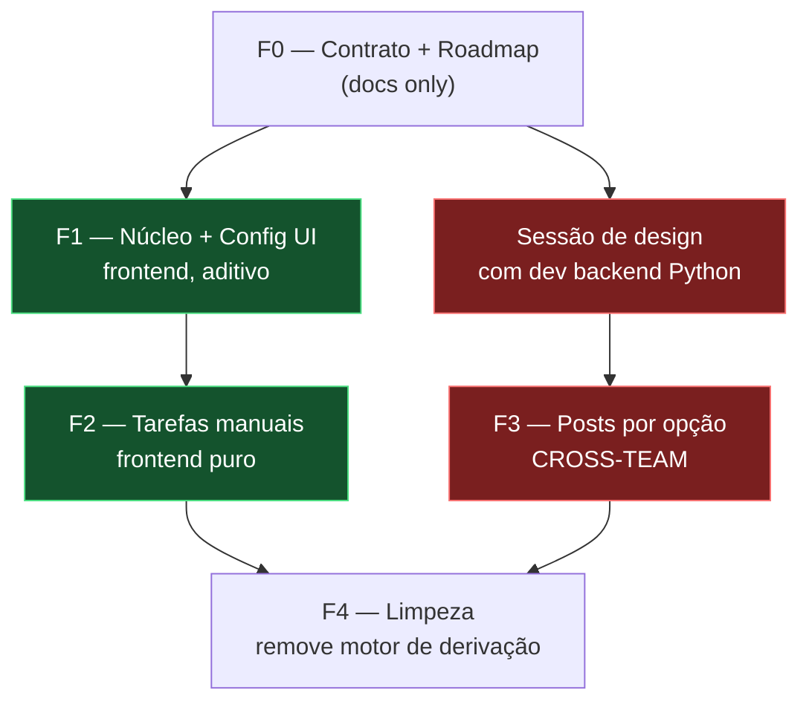

# Roadmap — Status global modelo "Notion" (grupos + opções, manual)

> **Pivô de produto**, não ajuste. Unifica os dois sistemas de status do wenox
> (tarefas e posts) num único conjunto **global** de **grupos + opções**, definido
> manualmente (estilo Notion), abandonando a derivação automática por etapas.
> Multi-fase, vários PRs. Esta é a fonte de planejamento; o cutover frontend↔backend
> é regido por [`status-global-contract.md`](./status-global-contract.md).

---

## 1. Problema — dois sistemas de status desconexos

Hoje convivem dois modelos independentes de status:

| | Tarefas | Posts (cards de mês) |
|---|---|---|
| Modelo | lista plana `StatusDef {id,nome,papel,cor}` | select fixo `status_post` |
| Onde | `src/tarefas/status.ts`, config `status_tarefa` | `src/quadros/types.ts` (`STATUS_POST`) |
| Valores | configuráveis | `em_producao / agendar / agendado / postado / em_alteracao` |
| Como é definido | **derivado** das etapas via `statusDerivado` (`src/tarefas/etapas.ts`), aplicado em `tarefasService.ts` (`criarTarefa` ~144, `salvarEtapas` ~313) | **derivado** da esteira via `statusDaEsteira`, e escrito também pelo **backend Python externo** |

O usuário quer um **único** modelo, no estilo do **Notion**: a propriedade **Status**
tem **grupos** (nível 1 — categoria + cor) e **opções** (nível 2) dentro de cada grupo.

### Decisões confirmadas
- **Escopo:** conjunto **global único** compartilhado por tarefas **e** posts (a mesma
  opção pode ser atribuída a uma tarefa ou a um post). Sem partição por contexto.
- **Grupos:** customizáveis (criar/renomear/reordenar/colorir grupos e opções).
- **Manual:** abandona a derivação por etapas. O status é escolhido na mão.
- **Kanban:** colunas **por opção**; o grupo dá categoria/cor.
- **Etapas:** viram **checklist informativo** — mantêm stepper, histórico, responsável
  e progresso, mas **deixam de afetar o status**.
- **Backend:** incluído — coordenação obrigatória com o dev do backend Python.

---

## 2. A costura: frontend-seguro × bloqueado-no-backend

O lado de **tarefas** é 100% frontend (a derivação é TS puro) e pode migrar isolado,
mantendo um espelho legado. O lado de **posts** **não pode**: `status_post` e
`etapas_card` são lidos/escritos pelo backend Python (publicação, agendamento,
`/_up/review`). Mudar posts sem o contrato novo quebra produção.



**F1 e F2 não dependem do backend.** F3 e F4 só avançam após a sessão de design e o
contrato assinado pelo dev do backend.

---

## 3. Modelo de dados alvo

Config global em `configuracoes`, **nova chave `status_global`**, versionada:

```ts
interface StatusGrupo  { id: string; nome: string; cor: CorStatus; ordem: number; }
interface StatusOpcao  { id: string; grupo: string /* StatusGrupo.id */; nome: string; cor: CorStatus; ordem: number; }
interface StatusGlobalConfig { versao: number; grupos: StatusGrupo[]; opcoes: StatusOpcao[]; }
```

- **Conjunto único** de grupos+opções, compartilhado por tarefas e posts.
- Reaproveita `CorStatus` / `CORES_STATUS` já existentes em `src/tarefas/status.ts`.
- `Tarefa` e `Cartao` passam a guardar **`status_opcao`** (id da opção escolhida).
- **Espelho legado:** ao gravar `status_opcao`, gravar também `status` (tarefa) ou
  `status_post` (card) com o nome/id legado equivalente — para o backend e o código
  antigo seguirem funcionando até F4.
- Kanban: colunas = opções na ordem; agrupadas/coloridas pelo grupo.

### Helpers novos (espelham os atuais de `status.ts`)
`opcaoPorId(id)` · `grupoDaOpcao(opcaoId)` · `corOpcaoClass(opcaoId)` ·
`opcoesDoGrupo(grupoId)`. Os exports legados (`useStatuses`, `corStatusClass`,
`statusInicial`, `statusConcluido`, `statusDoPapel`) ficam como **shims** sobre as
opções enquanto F2–F4 migram os ~25 consumidores.

---

## 4. Fases

### F0 — Contrato + Roadmap *(esta entrega)*
Produz os 3 docs: este roadmap, o [contrato novo](./status-global-contract.md) e o
banner de deprecação no contrato da esteira. **Sem código de produção.**

### F1 — Núcleo + Config UI *(frontend, aditivo — não liga nas telas)*
- **`src/tarefas/status.ts`** — reescrever para grupos+opções: store
  (`useSyncExternalStore` + cache `localStorage` + `subscribe`/`snapshot`, padrão atual),
  `carregarStatusRemoto`/`salvarStatusRemoto` na chave `status_global`, e os helpers novos.
  Manter shims legados.
- **`src/opcoes/StatusTarefaPage.tsx`** — vira editor de **grupos com opções aninhadas**:
  criar/renomear/reordenar/colorir grupos e opções; mover opção entre grupos.
  **Remover** a coluna "Papel automático" (`PapelStatus`, `setPapel`, `ROTULO_PAPEL`,
  `PAPEIS_STATUS`) e os avisos "sem inicial/concluído". Adaptar
  `contarTarefasComStatus`/`migrarStatusTarefas` para operar por `status_opcao`.

### F2 — Tarefas manuais *(frontend puro, com espelho legado)*
- **`src/tarefas/types.ts`** — adicionar `status_opcao?: string` ao tipo `Tarefa`.
- **`TarefaSheet` / `TarefaViewSheet`** — seletor de status **agrupado** manual
  (grava `status_opcao` + espelho `status`).
- **`TarefasTabela`** — coluna Status mostra a opção (cor do grupo).
- **`TarefasListPage`** (kanban) — **colunas por opção**; drag grava `status_opcao`.
- **`tarefasService.ts`** — `criarTarefa` (~144) e `salvarEtapas` (~313) **param** de
  chamar `statusDerivado`. Etapas viram checklist informativo: mantêm `EtapasStepper`,
  `confirmarEtapa`/`reabrirEtapa`, progresso e responsável — **sem** tocar `status`.
- **Consumidores de status de tarefa** — atualizar `MinhaSemanaList`,
  `dashboard/blocosNegocio`, `minha-area/blocos`, `TarefaCard`, `PortalClienteTarefas`,
  `format.ts`, e a parte de tarefa de `CalendarioPage`.

### F3 — Posts por opção *(CROSS-TEAM — após contrato + sessão de design)*
- **`src/quadros/types.ts`** — adicionar `status_opcao?: string` ao `Cartao`.
- **`CartaoSheet` / `QuadroBoardPage` / `CalendarioPage`** — chip de status vira opção
  global (grava `status_opcao` + espelho `status_post`).
- **Backend** passa a ler `status_opcao` para publicação/agendamento; `statusDaEsteira`,
  `STATUS_POST`, porteira/handoff são aposentados **em conjunto** com o backend.

### F4 — Limpeza *(após F2 e backend migrados)*
- Remover do frontend: `statusDerivado` (`etapas.ts`), `statusDaEsteira` /
  `STATUS_POST` / `sessionIndex` / `classify` / `GATES_PAPEL` (`quadros/types.ts`),
  `progressoCardsDasTarefas` + gating/handoff em `confirmarEtapaCard`
  (`quadrosService.ts`), `RevisaoPostsPage` (ou repensá-la como mudança manual de opção).
- Remover os espelhos legados `status` / `status_post` quando o backend não os ler mais.
- Atualizar/retirar testes dependentes de derivação/esteira:
  `tests/quadrosService.criarTarefaSocialMedia.test.ts`,
  `tests/quadrosService.cascade.test.ts`, `tests/quadrosService.editarMes.test.ts`,
  `tests/CartaoSheet.ehPost.test.tsx`.

---

## 5. Migração de dados *(via PB superuser, idempotente)*

1. Criar `status_global` inicial — grupos **A fazer / Em andamento / Concluído**, com
   opções mapeadas de `DEFAULT_STATUS` (tarefas) **e** de `STATUS_POST` (posts).
2. Backfill: para cada tarefa, `status_opcao` = opção equivalente ao `status` atual;
   para cada card, `status_opcao` = opção equivalente ao `status_post` atual.
3. Manter os espelhos legados durante a transição; removê-los só em F4, junto do backend.

### Mapa inicial sugerido grupo → opções

| Grupo | Cor | Opções de origem |
|---|---|---|
| A fazer | cinza | `Não iniciado` (tarefa), `Em produção` (post) |
| Em andamento | azul | `Em andamento`, `Aguardando aprovação`, `Em alteração` (tarefa); `Agendar`, `Em alteração` (post) |
| Concluído | verde | `Concluído` (tarefa); `Agendado`, `Postado` (post) |

> O agrupamento é ponto de partida — vira customizável pelo usuário após a migração.

---

## 6. Inventário de impacto

`grep -E 'useStatuses|statusDoPapel|statusDerivado|corStatusClass|status_post|STATUS_POST|statusDaEsteira|statusInicial|statusConcluido'`
casa ~26 arquivos.

- **Frontend-only (F1/F2):** `src/tarefas/{status,etapas,format,tarefasService,
  TarefasTabela,TarefasListPage,MinhaSemanaList,PortalClienteTarefas,TarefaCard,
  TarefaSheet,TarefaViewSheet,TarefaDetailPage,EtapasStepper,QuickAddTarefa,
  TarefasTabProjeto}.tsx`, `src/minha-area/blocos.tsx`,
  `src/dashboard/blocosNegocio.tsx`, `src/opcoes/StatusTarefaPage.tsx`.
- **Cross-team (F3/F4):** `src/quadros/{types,CartaoSheet,QuadroBoardPage,
  CalendarioPage,quadrosService}.ts(x)`, o backend Python, e os 4 testes acima.

---

## 7. Riscos / pontos em aberto

- **Cross-team:** F3/F4 não avançam sem a sessão de design e o contrato assinado pelo
  dev do backend.
- **Conjunto único tarefa×post (decidido):** opções como "Agendado" aparecerão também
  na seleção de tarefas; mitigar com agrupamento/ordenação.
- **Reversão de trabalho recente (confirmado):** abandona porteira/handoff/derivação/
  prazos-por-etapa; etapas viram checklist informativo. O contrato da esteira
  (`docs/esteira-revisao-layout-contract.md`) é depreciado.
- **Multi-fase:** vários PRs ao longo do tempo. Esta entrega cobre só F0 (docs).
